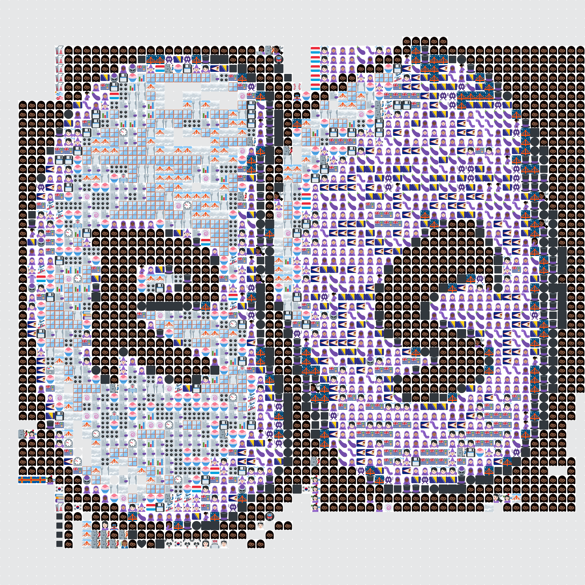

# Emojify-Image
Converts a given image into an image of similarily coloured emojis

## Example

* Before  

* After

## Usage
Simply put the desired PNG in the src directory, `open calculateRGB.py`, and edit  `userImage = io.imread('osrsIcon.png')[:,:,:-1]` to refer to your png image of choosing instead of `osrsIcon.png`.
## NOTES
This program has three major issues,
 * Dominant color of emojis is recalculated every single time `calculateRGB.py` is ran.
 * The larger the image the more significant the memory usage, making it very easy to run out of memory so only suitably small image files will currently work.
 * Because of the way twitter emojis are designed, even if the alpha channel of a twitter emoji makes the area transparent in the emoji, they still have a slightly green color associated with this transparent pixel. This leads to emojis with many transparent pixels having a dominant color similar to green being selected, which can make certain images with transparent pixels slightly off around those areas.
